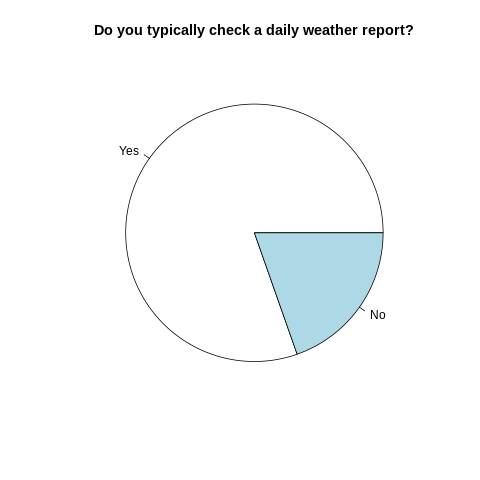
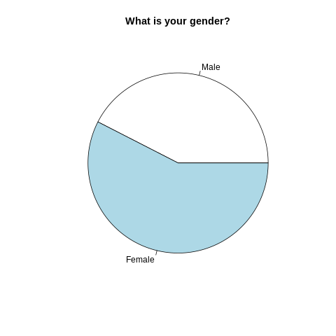
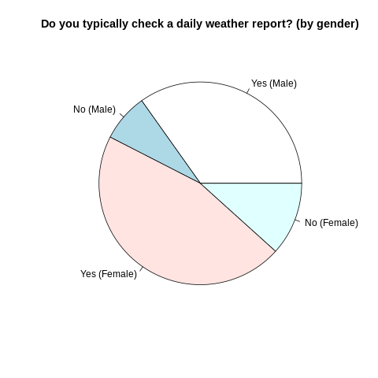

# weather-check
Project testing R language capabilities

Original data from https://github.com/fivethirtyeight/data/blob/master/weather-check/weather-check.csv

## Instructions
You will need RStudio (https://rstudio.com) to open this project.

The other option is to run weather-check.R in your environment, verifying the CSV file and a **/charts** folder are present at the same location.

## To Do
- Using external libraries (eg: ggplot)
- ...

## Charts generated

